# Summary

* [Giới thiệu Kicad](#kicad-introduction)
* [Các bước làm việc với Kicad](#kicad-workflow)
* [Thiết kế nguyên lý](#schematics)
* [Vẽ mạch in](#pcb)
* [Đồng bộ mạch nguyên lý và PCB](#annotation)
* [Tạo thư viện nguyên lý](#schematic-library)
* [Tạo thư viện chân PCB](#pcb-library)
* [Học Kicad từ Altium](#kicad-from-altium)
* [Những lưu ý, mẹo và nguồn tài liệu hữu ích khác](#tips-and-tricks)

Đây là bài dịch từ website: http://kicad-pcb.org

## 1. [Giới thiệu KiCad](#kicad-introduction)

KiCad là một công cụ phần mềm thiết kế mạch nguyên lý và mạch in (PCB) trong lĩnh vực điện tử mã nguồn mở. Bên trong phần hệ thống phần mềm KiCad là những phần mềm chạy độc lập như sau:

| Tên chương trình | Mô tả                                                              | Đuôi mở rộng                    |
|------------------|--------------------------------------------------------------------|---------------------------------|
| KiCad            | Chương trình quản lý dự án KiCad                                   | *.pro                           |
| Eeschema         | Chương trình vẽ mạch (cả mạch nguyên lý và thư viện nguyên lý)     | *.sch, *.lib, *.net             |
| CvPcb            | Lựa chọn thư viện chân Footprint                                   | *.net                           |
| Pcbnew           | Chương trình vẽ mạch in PCB                                        | *.kicad_pcb                     |
| GerbView         | Gerber viewer                                                      | All the usual gerbers           |
| Bitmap2Component | Chương trình chuyển Bitmap thành PCB hay thư viện chân Footprint   | *.lib, *.kicad_mod, *.kicad_wks |
| PCB Calculator   | Tính toán cho linh kiện, độ rộng đường mạch, khoảng hở, mã màu ... | None                            |
| Pl Editor        | Page layout editor                                                 | *.kicad_wks                     |

> **Note** Danh sách file mở rộng trên chưa đầy đủ và chỉ chứa một phần các tập tin mà KiCad có thể làm việc, như vậy sẽ đơn giản và dễ nắm bắt hơn.

KiCad có thể đảm bảo độ tin cậy để phát triển thành công những sản phẩm điện tử phức tạp.

KiCad không giới hạn kích thước board mạch và dễ dàng sử dụng để thiết kế mạch lên tới 32 lớp, tới 14 lớp kỹ thuật và 4 lớp bổ trợ. KiCad có thể tạo tất cả các file cần thiết cho việc tạo nên tấm PCB, Gerber file cho máy Photo-Plotter (máy tạo Film chế bản), file khoan (drl hay NC), vị trí linh kiện (phục vụ SMT - cắm linh kiện bằng máy) và nhiều loại khác.

Bằng việc mở mã nguồn (giấy phép GPL), KiCad chính là công cụ lý tưởng cho các dự án có ý định mở mã nguồn phần cứng.

Trang chủ KiCad là: [http://wwww.kicad-pcb.org](http://wwww.kicad-pcb.org)

### 1.1. Tải và cài đặt KiCad

KiCad có thể chạy trên GNU/Linux, Apple OSX và Windows, bạn có thể tìm bản cài đặt phù hợp tại:
[http://www.kicad-pcb.org/download/](http://www.kicad-pcb.org/download/)

> **Warning** KiCad cho ra các phiên bản mới theo [chính sách xuất bản](http://ci.kicad-pcb.org/job/kicad-doxygen/ws/Documentation/doxygen/html/md_Documentation_development_stable-release-policy.html). Những tính năng mới liên tục được cập nhật vào nhánh development. Nếu bạn muốn trải nghiệm những tính năng mới đó và kiểm nghiệm giúp KiCad, hãy tải bản biên dịch nightly cho hệ điều hành của bạn. Bản biên dịch Nightly có khả năng có nhiều lỗi phát sinh, nhưng mục tiêu chính của Nhóm phát triển KiCad là luôn giữ cho nhánh Development trong trạng thái thử nghiệm, cho tới khi nào các tính năng được kiểm nghiệm hoàn chỉnh.

#### 1.2. GNU/Linux

##### Bản cài đặt ổn định

Bản cài đặt ổn định KiCad có thể tìm thấy tại hầu hết các trình quản lý gói cài đặt của bản phân phối Linux với tên gọi `kicad` và `kicad-doc`. Nếu bản phân phối của bạn không cung cấp bản cài đặt ổn định mới nhất, vui lòng làm theo hướng dẫn biên dịch, lựa chọn và cài đặt cho bản cài đặt chưa ổn định, nhưng lựa chọn bản ổn định, mới nhất.

##### Bản cài đặt chưa ổn định (Nightly developement)

Hầu hết đều được biên dịch từ mã nguồn mới nhất. Thỉnh thoảng xuất hiện các lỗi như hỏng file, tạo gerber sai, ... nhưng luôn có tính năng mới nhất.

Ở hệ điều hành Ubuntu, cách dễ nhất cài bản nightly build là sử dụng *PPA* và *Aptitude*. Thực hiện các lệnh sau trong Terminal:

```shell
sudo add-apt-repository ppa:js-reynaud/ppa-kicad
sudo aptitude update && sudo aptitude safe-upgrade
sudo aptitude install kicad kicad-doc-en
```

Với Fedora, cách dễ nhất thông qua *copr*

```shell
sudo dnf copr enable mangelajo/kicad
sudo dnf install kicad
```

Ngoài ra, có thể tải và cài đặt bản biên dịch trước của KiCad, hoặc tải trực tiếp mã nguồn, biên dịch và cài đặt

#### 1.3. Apple OS X

##### Bản cài đặt ổn định

Có thể tìm thấy [http://downloads.kicad-pcb.org/osx/stable/](http://downloads.kicad-pcb.org/osx/stable/)

##### Bản cài đặt chưa ổn định (Nightly developement)

Tải và cài đặt tại: [http://downloads.kicad-pcb.org/osx/nightly/](http://downloads.kicad-pcb.org/osx/nightly/)

#### 1.4. Windows

##### Bản cài đặt ổn định

Tải và cài đặt: [http://downloads.kicad-pcb.org/windows/stable/](http://downloads.kicad-pcb.org/windows/stable/)

##### Bản cài đặt chưa ổn định (Nightly developement)

Tải và cài đặt: [http://downloads.kicad-pcb.org/windows/nightly/](http://downloads.kicad-pcb.org/windows/nightly/)

#### 1.5. Thông tin hỗ trợ

Nếu bạn có ý tưởng, nhận xét hay bất kỳ câu hỏi nào, hay cần trợ giúp:
- Ghé thăm [diễn đàn](https://forum.kicad.info/)
- Tham gia [kênh #kicad IRC](http://webchat.freenode.net/?channels=kicad) trên Freenode
- Xem các [hướng dẫn](http://kicad-pcb.org/help/tutorials/)

## 2. [Tiến trình làm việc với KiCad](#kicad-workflow)

Mặc dù có sự tương đồng với những phần mềm thiết kế mạch khác, KiCad vẫn có đặc trưng bằng tiến trình công việc có sự phân biệt rõ ràng giữa 2 công cụ thiết kế nguyên lý và mạch in PCB.

### 2.1. Tổng quan tiến trình làm việc

Tiến trình làm việc với KiCad chia ra làm 2 phần chính là thiết kế nguyên lý và vẽ mạch in PCB. Cả 2 phần, thư viện nguyên lý và thư viện chân Footprint đều cần thiết cho cả 2 phần.

Trong hình dưới, là mô hình tiến trình làm việc hiện tại với KiCad, giải thích rõ ràng từng bước bạn cần phải thực hiện. Đồng thời các biểu tượng được thêm vào cho dễ dàng thực hiện.


Để có nhiều thông tin hơn về việc tạo thư viện nguyên lý, bạn có thể xem mục: [Tạo thư viện nguyên lý](#schematic-library). Và phần tạo thư viện chân Footprint linh kiện xem ở mục: [Tạo thư viện chân PCB](#pcb-library).

### 2.2. Đồng bộ giữa mạch nguyên lý và PCB

Một mạch nguyên lý sau khi được vẽ đầy đủ thì bước tiếp theo phải chuyển sang vẽ PCB. Một bản mạch khi một khi muốn hoàn thiện thì trong quá trình vẽ có thể thêm và bớt linh kiện. Điều này có thể thực hiện theo 2 hướng: Tới và Lùi.

Việc đồng bộ Tới là tiến trình chuyển sự thay đổi từ mạch nguyên lý, và làm cho PCB đúng với nó. Điều này là cơ bản vì không ai muốn phải vẽ lại mạch PCB mỗi khi có thay đổi. Có thể xem thêm [Đồng bộ mạch nguyên lý và PCB](#annotation)


## 3. [Schematics]

### 4. [PCB](#pcb)
#### Layer
##### Giới thiệu
Pcbnew có thể làm việc với 50 layer khác nhau:
- 1 - 32 layer đồng để đi dây
- 14 layer  với mục đích cố định:
  - 12 layer technical theo cặp (trước và sau): : Adhesive, Solder Paste, Silk Screen, Solder Mask, Courtyard, Fabrication
  - 2 layer chuyên biệt: Edge Cuts, Margin
- 4 layer phụ trợ có thể sử dụng bất kì: : Comments, E.C.O. 1, E.C.O. 2, Drawings
##### Thiết lập layer
- mở Layer setup từ menubar , chọn Design Rules → Layers Setup.
- Số lương layer đồng, tên, chức năng được cấu hình ở đây. Layer technical không sử dụng có thể disable.
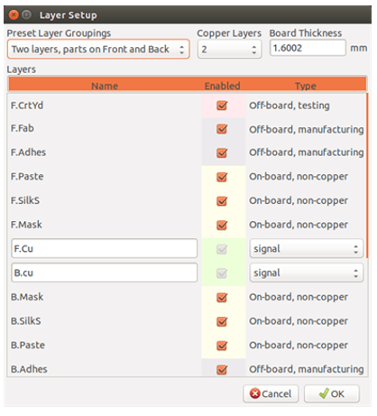

#### Mô tả Layer
##### Copper Layer (layer đường mạch):
là lớp được sử dụng để đặt và sắp xếp các đường mạch (Lớp Front bắt đầu từ con số 0, inner layers là các lớp bên trong bắt đầu từ số 1- 30 và kết thúc là lớp Back thứ 31). Linh kiện chỉ có thể đặt ở lớp Front(0) và Black(31) mà không thể đặt ở các lớp bên trong (inner layers 1-30).
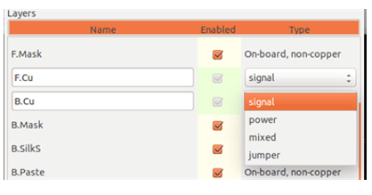

##### Technical Layer theo cặp:
12 layer technical đi theo cặp: 1 cho Front và 1 cho Back (dễ dàng nhận ra chúng với các tiền tố F và B).
- Adhesive (F.Adhes and B.Adhes): Lớp sử dụng cho để dán chất kết dính các linh kiện SMD khi hàn máy SMT. (x)
- Solder Paste (F.Paste and B.Paste): Sử dụng như lớp mặt nạ của linh kiện, dùng để làm stencil.
- Silk Screen (F.SilkS and B.SilkS): Lớp nhãn dán, tên linh kiện
- Solder Mask (F.Mask and B.Mask): Lớp solder, xác định mặt nạ cho việc phủ bảo vệ đường mạch.
- Courtyard (F.CrtYd and B.CrtYd): lớp hiển thị không gian thành phần vật lý trên PCB. (x)
- Fabrication (F.Fab and B.Fab): lắp ráp footprint, thường là lớp tên linh kiện.
##### Technical Layer độc lập:
- Edge.Cuts: Lớp này dùng để vẽ board outlines.
- Margin:
##### Các Layer với mục đích sử dụng chung:
- sử dụng cho bất kỳ mục đích gì. có thể sử dụng các hướng dẫn, ghi chú,...
• Comments
• E.C.O. 1
• E.C.O. 2
• Drawings
##### Chọn lựa các layer cần active
lựa chọn active các lớp làm việc có thể bằng nhiều cách:
- toolbar (Layer manager).
- thanh công cụ phía trên.
- Click chuột phải với các pop-up.
- sử dụng phím + và - (chỉ làm việc với copper layer)
- sử dụng phím nóng.
#4. Vẽ mạch in
Bây giờ là phần thiết kế PCB sử dụng file netlist mà bạn đã xuất được. Điều này được thực hiện với công cụ Pcbnew.
##4.1 Sử dụng Pcbnew.
1. Từ cửa sổ KiCad, click vào biểu tượng *Pcbnew* . Cửa sổ Pcbnew sẽ mở ra. Nếu bạn nhận được một thông báo lỗi nói rằng một fie * .kicad_pcb không tồn tại và hỏi bạn có muốn tạo ra nó, chỉ cần bấm Yes.
2. Bắt đầu với một số thông tin bản vẽ. Click vào biểu tượng thiết lập trang  trên thanh công cụ. Thiết lập kích thước giấy A4 và tiêu đề Tutorial 1.
3. Để bắt đầu ý tưởng thiết kế tốt nhất bạn phải thiết lập các thông số clearance và minimum track width theo yêu cầu của nhà sản xuất PCB. Nhìn chung, bạn có thể thiết lập clearance từ 0.25 và minimum track width từ 0,25. Click vào **Design Rules** → **Design Rules** trên thanh công cụ.Nếu không thấy hiển thị, Click vào tab Net Lớp Editor. Thay đổi trường Clearance ở trên của cửa sổ là 0,25 và trường Track Width là 0,25 như hình dưới đây. Đơn vị ở đây là trong mm.
 
4. Click vào tab *Global Design Rules* và thiết lập Min track width 0.25’. Click OK để thực hiện các thay đổi và đóng cửa sổ *Design rules Editor*.
5. Bây giờ chúng ta sẽ nạp file netlist. Nhấp vào biểu tượng Read Netlist  trên thanh công cụ. Click vào nút Browse Netlist Files, chọn tutorial1.net trong hộp thoại, và click vào *Read Current Netlist*. Sau đó nhấp vào nút **Close**
6. Tất cả các linh kiện bây giờ nên hiển thị ở góc trên bên trái của trang.
7. Chọn tất cả các linh kiệt với chuột và di chuyển chúng đến giữa board. Nếu cần thiết bạn có thể phóng to thu nhỏ trong khi bạn di chuyển các linh kiện.
8. Tất cả các dây kết nối các linh kiện được gọi là ratsnest. Hãy luôn để chế độ Hide board ratsnest trên nút       . Bằng cách này bạn có thể xem các nhóm liên kết tất cả các linh kiện.
> **Note** Chọn tool-tip Để hiển thị các Ratsnest.

9. Bạn có thể di chuyển mỗi linh kiện bằng cách di chuột lên đó và nhấn phím g. Nhấp vào nơi bạn muốn đặt chúng. Di chuyển tất cả các linh kiện hợp lý cho đến khi bạn giảm thiểu số lượng dây chéo nhau.
> **Note** Nếu thay vì di chuyển các linh kiện (với phím g) bạn di chuyển chúng xung quanh bằng cách sử dụng phím m sau đó bạn sẽ thấy rằng bạn bị mất kết nối. Tóm lại, luôn luôn sử dụng phím g là chính.

 .
10. Nếu ratsnest biến mất hoặc màn hình bị lộn xộn, nhấp chuột phải và nhấp vẽ lại xem. Lưu ý làm thế nào một chân của điện trở 100 ohm được kết nối với chân số 6 của PIC. Đây là kết quả của việc sử dụng các ký hiệu kết nối các chân.
11. Bây giờ chúng ta sẽ xác định các biên của PCB. Chọn *Edge.Cuts* từ trình đơn thả xuống trong thanh công cụ. Click vào biểu tượng *Add graphic line or polygon*  trên thanh công cụ bên phải. Vạch ra đường bao xung quanh board, click ở mỗi góc, và nhớ để lại một khoảng trống nhỏ giữa các cạnh của màu xanh lá cây và các cạnh của PCB.
12. Tiếp theo, kết nối tất cả các dây trừ GND. Trong thực tế, các dây GND được kết nối ở lớp bot board đồng.
13. Bây giờ chúng ta phải chọn lớp để vẽ. Chọn F.Cu (PgUp) trên thanh công cụ như hình bên dưới. Đây là lớp top.

 
14. Trong trường hợp nếu bạn chọn thiết kế mạch in 4 lớp, chọn **Design Rules** →**Layer Setup** thay đổi copper layer thành 4. Trong bảng layers bạn có thể đặt tên lớp và chọn lớp cần dùng.Lưu ý, bạn có thể chọn các cài đặt thông qua mục *Preset Layer Groupings*.
15. Click vào *Add Tracks and vias icon* trên thanh công cụ bên phải. Click vào chân 1 của J1 và chạy một đường tới pad R2. click đôi chuột để thiết lập các điểm mà đường mạch sẽ kết thúc. Đường mạch ở đây có độ kích thước mặc định là 0.250mm. Bạn có thể thay đổi kích thước từ trình đơn kéo xuống trong thanh công cụ trên. Nhớ rằng theo mặc định bạn chỉ có một kích thước đường mạch chọn sẵn.

 
16. Nếu bạn muốn chọn kích thước đường mạch khác: chọn **Design Rules** → **Design Rules** → **Global Design Rules** và tại góc dưới bên phải của cửa sổ này bạn có thể thêm bất kỳ các kích thước mà bạn muốn chọn.Bạn cũng có thể chọn kích thước của đường mạch từ thanh trình đơn trong khi bạn vẽ layout. Xem ví dụ dưới đây (inches).

 
17. Ngoài ra, bạn cũng có thể thêm một Class Net mà bạn chỉ định một nhóm các tùy chọn. chọn **Design Rules** → **Design Rules** → **Net Classes Editor** , thay đổi độ rộng đường từ 8 mil (tương đương 0,0080) đến 24 mil (tương đương 0,0240). Tiếp theo là thêm các đường mass và đường nguồn (chọn mặc định ở bên trái và nguồn ở bên phải và sử dụng các mũi tên).
18. Nếu bạn muốn thay đổi kích thước lưới. **Click chuột phải** → **Gird Select**. Hãy luôn để kích thước lưới phù hợp trước và sau khi sắp xếp, đi dây các linh kiện.
19. Lặp lại quá trình này cho đến khi tất cả các dây, ngoại trừ chân 3 của J1, được kết nối. Board mạch của bạn sẽ trông giống như ví dụ dưới đây.
 
20. Bây giờ hãy đi một đường mạch ở lớp khác của PCB. Chọn B.Cu trong trình đơn kéo xuống trên thanh công cụ trên. Click vào *Add tracks and vias* biểu tượng  . Vẽ một đường giữa chân 3 của J1 và chân 8 của U1. Điều này thực sự là không cần thiết vì chúng ta có thể đổ đồng chung với mass. Chú ý màu sắc của các đường mạch được thay đổi.
21. Đi dây từ chân A đến chân B bằng cách thay đổi lớp. Thay đổi các lớp trong quá trình đi dây bằng cách đặt một Via. Trong khi bạn đang đi dây ở lớp top, click chuột phải và chọn *Place Via*  hoặc đơn giản nhấn phím v. Điều này sẽ đưa bạn đến các lớp Bot để đi hoàn chỉnh đường mạch.

 
22. Khi bạn muốn kiểm tra một kết nối bạn có thể Click chuột vào các biểu tượng *Net Highlight*  trên thanh công cụ bên phải. Click vào chân 3 của J1. Các dây kết nối và chân kết nối được hiện nối lên.
23. Bây giờ chúng ta sẽ đổ đồng board chung với mass. Click vào biểu tượng Add Zones  trên thanh công cụ bên phải. Một khung chữ nhật sẽ tạo ra xung quanh board, chọn lớp bạn muốn đổ đồng ở góc trên bên trái hộp thoại.Phía dưới hộp thoại, chọn *Pad in zone* là *Thermal relief* và *Zone edges orient* là H, V và bấm OK.
24. Vẽ đường bao xung quanh board bằng cách click các góc board. Click đôi để hoàn thành hình chữ nhật của bạn. Kích chuột phải vào bên trong board. Click chuột chọn *Fill or Refill All Zones*.

Lựa chọn layer sử dụng layer manager
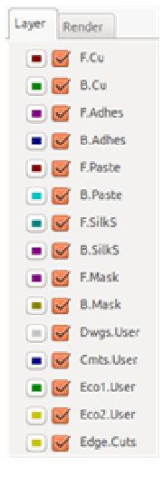

Lựa chọn layer sử dụng upper toolbar
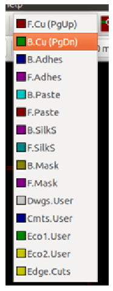

Lựa chọn layer the pop-up window
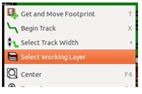

cửa sổ pop-up mở ra menu lựa chọn các layer
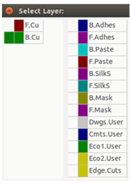

##Lựa chọn layers cho Vias
nếu add vias bằng cách lựa chọn icon trên toolbar, cửa sổ Pop-Up cung cấp lựa chọn thay đổi các cặp layer sử dụng vias:
 
25. Kiểm tra các kết nối bằng cách click chuột vào biểu tượng  trên thanh công cụ. Click chọn *Start DRC*. Xem có lỗi nào không. Click vào *List Unconnected* xem các dây chưa kết nối. Click OK để đóng hộp thoại **DRC Control**.
26. Lưu tập tin của bạn bằng cách Click vào **File** → **Save**. Để xem 3D, Click vào **View** → **3D Viewer**.

 
27. Bạn có thể kéo chuột của bạn xung quanh để xoay PCB.
28. Board mạch của bạn đã hoàn tất. Để gửi nó đi đến một nhà sản xuất, bạn sẽ cần phải tạo ra tất cả các file Gerber.

##4.2 Xuất file Gerber

Khi PCB của bạn được hoàn tất, bạn có thể tạo các file Gerber cho mỗi lớp và gửi cho nhà sản xuất PCB yêu thích của bạn, những người sẽ sản xuất PCB cho bạn.
1. Từ KiCad, mở công cụ phần mềm Pcbnew và tải file của bạn bằng cách click vào biểu tượng .
2. Click vào **File** → **PLot**. Chọn Gerber từ *Format Plot* và chọn thư mục trong đó để đặt tất cả các file Gerber. Xử lý bằng cách Click vào nút *Plot*.
3. Đây là những lớp bạn cần phải lựa chọn để làm một PCB 2 lớp điển hình:

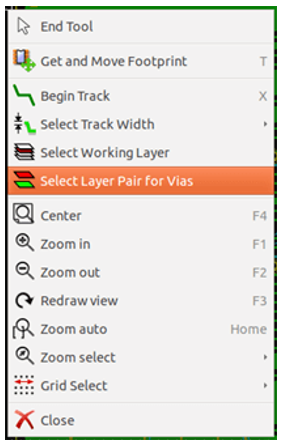

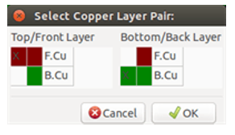

Khi vias được đặt, layer sẽ tự động chuyển qua lớp khác của cặp lớp sử dụng cho vias.
##Using the high-contrast mode (giống shift + S trong altium):
Chế độ hoạt động khi công cụ này phía trên thanh công cụ được kích hoạt
Khi ở chế độ này, lớp active sẽ hiển thị bình thường, các lớp còn lại sẽ hiển thị tối (xám) màu.
| Layer                  |KiCad Layer Name  |Old KiCad Layer Name   |Default Gerber Extension    | "Use Protel filename extensions" is enabled |
| :------- | :---- | :---- | :------ | :--- |
| Bottom Layer    | B.Cu | Copper |.GBR   | .GBL |
| Top | F.Cu| Component | .GBR| .GTL   |
| Top Overlay | F.SilkS  | SilkS_Cmp |.GBR   | .GTO  |
| Bottom Solder Resistx |B.Mask | Mask_Cop  |.GBR   |  .GBS |
| Bottom Solder Resist   | F.Mask |  Mask_Cmp|.GBR   | .GTS |
| Edges    | Edge.Cuts  | Edges_Pcb |.GBR  |  .GM1 |

##4.3 SỬ dụng GerbView

1. Để xem tất cả các file Gerber Bạn phải vào Kicad và click vào biểu tượng *GerbView*. Trên Thanh công cụ chọn *Layer 1*. Click **File** → **Load Gerber file** hoặc Click biểu tượng . Tải các file gerber xuất được cùng một lúc.
2. Sử dụng thanh menu bên phải để chọn / bỏ chọn lớp để hiển thị. Cẩn thận kiểm tra từng lớp trước khi gửi cho nhà sản xuất.
3. Để xuất ra file khoan, từ Pcbnew vào phần **File** → **chọn Plot**. Nên chọn các thiết lập mặc định.

##4.4 Đi dây tự động với FreeRouter.
Đi dây bằng tay là rất tốt, tuy nhiên với một board có nhiều linh kiện bạn sẽ muốn đi dây tự động. Bạn nên đi dây bằng tay trước sau đó mới đi dây tự động để bớt nhàm chán. Qua trình đi dây tự động được thực hiện tại FreeRouter từ freerouting.net.
>**Note** Freerouter là một ứng dụng java mã nguồn mở. mã nguồn của Freerouter có thể được tìm thấy trên trang web: [https://github.com/nikropht/FreeRouting](https://github.com/nikropht/FreeRouting).

1. Từ Pcbnew click vào **File** → **Export** → **Specctra DSN** hoặc nhấp chuột vào **Tools** → **FreeRoute** → **Export a Specctra Design (*.dsn) file** và lưu các tập tin cục bộ. Khởi FreeRouter và nhấn vào nút *Open Your Own Design*, duyệt các file *DSN* và load nó.
>**note** Tools → FreeRoute, bạn click vào nút help xem  tài liệu  Hướng dẫn. Hãy làm theo các hướng dẫn để sử dụng FreeRoute hiệu quả.
###Copper layers in high-contrast mode
- Normal mode

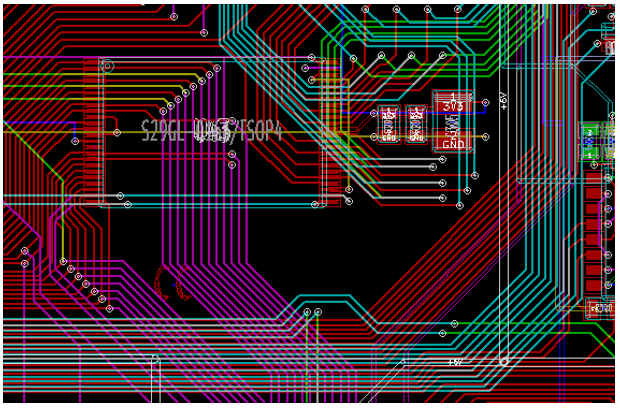

- High-contrast mode
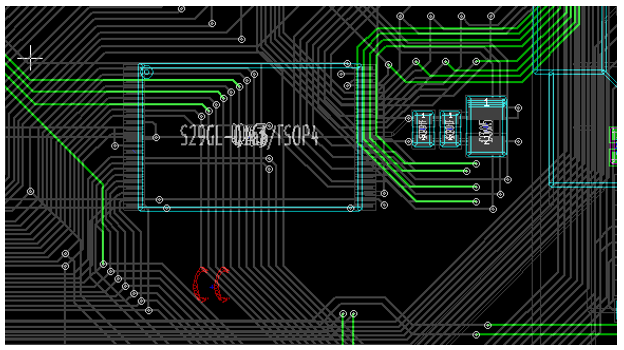

###Technical layers
- Normal mode

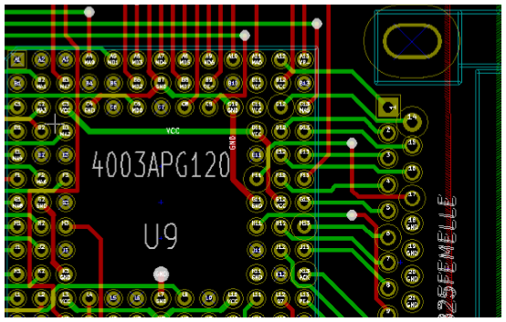

2. FreeRouter có một số tính năng mà KiCad hiện không có, cả cho việc hướng dẫn đi dây và cho việc đi dây tự động. FreeRouter hoạt động ở hai bước chính: đầu tiên, Đi dây và sau đó xử lý lại. Quá trình chỉnh sửa có thể mất một thời gian dài, tuy nhiên bạn có thể dừng lại bất cứ lúc nào cần thiết.
3. Bạn có thể bắt đầu việc đi dây tự động bằng cách nhấp vào nút Autorouter trên thanh trên cùng. Thanh dưới cùng cung cấp cho bạn thông tin về quá trình đi dây đang diễn ra. Nếu số dây không đi được trên 30, board mạch của bạn có thể có thể không được autorouted. sắp xếp lại các linh kiện, xoay chúng phù hợp và thử lại. Mục đính là để giảm số dây chéo nhau.
4. Khi click chuột trái thì quá trình đi đây tự động sẽ ngừng. Nhấp chột trái một cái sẽ ngăn chặn quá trình xử lý board. Trừ khi bạn thực sự cần phải dừng lại, nó là tốt hơn để cho FreeRouter hoàn thành công việc của mình. Quá trình xử lý board sẽ tốt nhất khi quá trình đi dây tự động kết thúc trừ khi bạn thật sự muoonns dừng lại.
- High-contrast mode

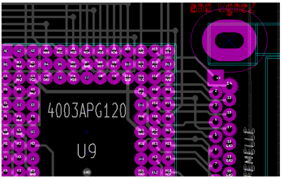
5. Click vào **File** → **Export Specctra Session File** và lưu các tập tin với đuôi .ses. Bạn không thực sự cần phải lưu các tập tin theo FreeRouter.
6. Trở lại Pcbnew. Bạn có thể mở board đã đi dây tự động bằng cách nhấp vào **Tools** → **FreeRoute** và sau đó vào biểu tượng lại *Import (.ses) File Spectra Session* và chọn tập tin .ses của bạn.
Nếu có bất kỳ đường mạch nào bạn không thích, bạn có thể xóa nó và đi lại một lần nữa, sử dụng phím del và các công cụ vẽ, công cụ *Add tracks*  trên thanh công cụ.

