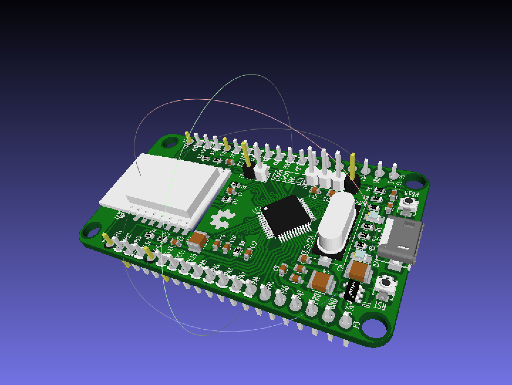

# KiCAD PCB Tips & Trick

## Export Board 3D to STL from KiCAD 3D

- From KiCAD PcbNew, select File -> Export -> VRML file
- Download and install [meshlab](http://meshlab.sourceforge.net/)
- From Meshlab, select File -> Import Mesh -> Select file *WRL was exported 
- From Meshlab, select File -> Export Mesh As -> Select *STL file

**GitHub can host and render 3D files with the .stl extension**